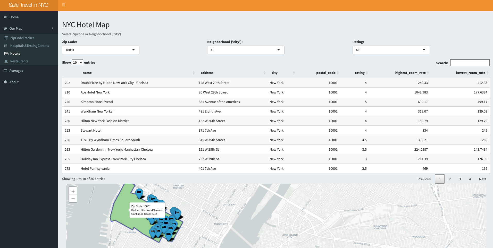

# Project 2: Shiny App Development

### [Project Description](doc/project2_desc.md)





## Safe Travel in NYC
Term: Fall 2020

+ Team 1
+ **Project title**: Safe Travel in NYC 
	+ Levi Lee
	+ Tianle Zhu
	+ Xinyuan Peng
	+ Yuwei Tong
	+ Zhenglei Chen
	
+  **Shiny Link**: https://yvonneywtong.shinyapps.io/SafeTravelNYCv1/

+ **Project summary**: This Shiny app is designed to help users (individuals, tourists, small businesses, local papers, and healthcare providers) nagivate and understand NYC COVID-19 data. We offer different features to allow people to understand recent and local NYC COVID-19 cases and offer recommendations for accommodations. 

+ **Source of the Data Set**: NYC OpenHealth, NYC Health + Hospitals, Department of Transportation, Department of Health and Mental Hygiene, and Johns Hopkins University

+ **Contribution statement**: 
Five group members (Levi Lee, Tianle Zhu, Xinyuan Peng, Yuwei Tong, Zhenglei Chen) contribute to the group project.

Levi Lee worked on the basic framework and main COVID Zip Code tracker tab and added interactive features such as the dropdown menu, checkbox, and radio buttons. He also created tables of averages in the averages tab and added preliminary information onto the Home tab. 

Tianle Zhu carried out data pre-processing, including cleaning and grouping, for testing center and restaurant data, plotted the pie chart for average tab, developed the restaurant map by using informative features such as filters and checkbox, designed dashboard and panel layouts to complete the Shiny application.

Xinyuan Peng worked on the hotel tab, policy part in Home tab and credits part in About tab.

Yuwei Tong worked on the hospitals part, added boroughs markers on the map with popup information, combined hospitals part and testing centers part into a single tab with radio buttons, and added disclaimer information into About tab.

Zhenglei Chen worked on the testing centers part, added data visualization to the average page, polished the home page by adding pictures.

All team members approve our work presented in our GitHub repository including this contribution statement.

Following [suggestions](http://nicercode.github.io/blog/2013-04-05-projects/) by [RICH FITZJOHN](http://nicercode.github.io/about/#Team) (@richfitz). This folder is orgarnized as follows.

```
proj/
├── app/
├── lib/
├── data/
├── doc/
└── output/
```

Please see each subfolder for a README file.

