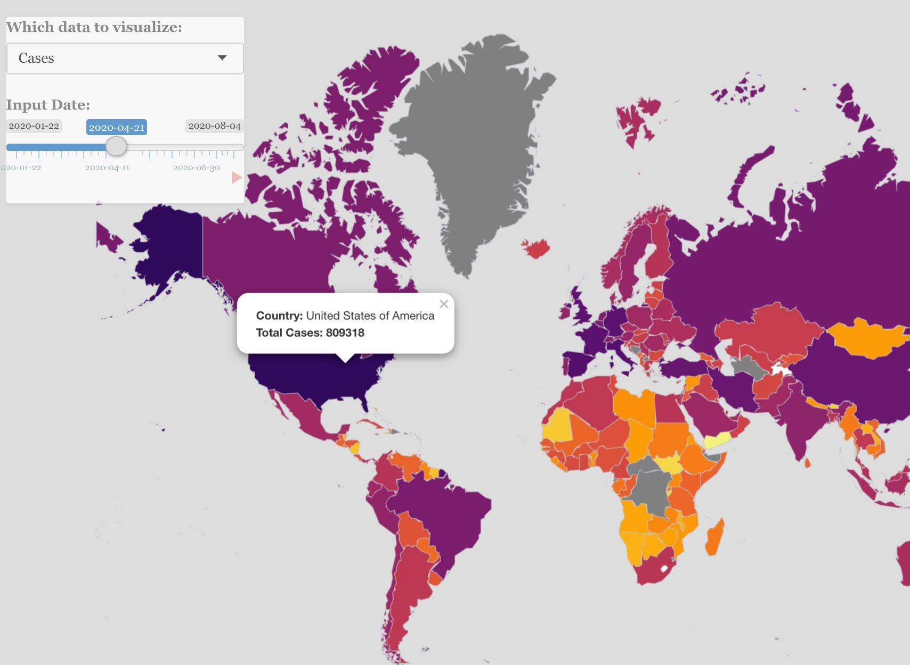

# Project 2: Shiny App Development

### [Project Description](doc/project2_desc.md)



## Project 2: 
Term: Fall 2020

+ Team 1
+ **Projec title**: 
	+ Levi Lee
	+ Tianle Zhu
	+ Xinyuan Peng
	+ Yuwei Tong
	+ Zhenglei Chen
	
+  **Shiny Link**: 

+ **Project summary**: This Shiny app is designed to help users (individuals, tourists, small businesses, local papers, and healthcare providers) nagivate and understand NYC COVID-19 data. We offer different features to allow people to understand recent and local NYC COVID-19 cases and offer recommendations for accommodations. 

+ **Source of the Data Set**: NYC OpenHealth, NYC Health + Hospitals

+ **Contribution statement**: 
Five group members ( Levi Lee, Tianle Zhu, Xinyuan Peng, Yuwei Tong, Zhenglei Chen) contribute to the group project.

Levi Lee worked on the main COVID Zip Code tracker map and added interactive features such as the dropdown menu, checkbox, and radio buttons. He also created tables of averages in the averages tab and added preliminary information onto the Home Tab. 

Tianle Zhu carried out data pre-processing for testing center and restaurant data, designed and developed the restaurant map, and add informative filters to complete the shiny structure.

Xinyuan Peng worked on the hotel tab, homepage's policy and DataSource's credits

Yuwei Tong worked on the hospitals part, combined hospitals part and testing centers part into a single tab, and added disclaimer information into Data Source tab.

Zhenglei Chen worked on the testing centers part, added data visualization to the average page, polished the home page by adding pictures

All team members approve our work presented in our GitHub repository including this contribution statement.

Following [suggestions](http://nicercode.github.io/blog/2013-04-05-projects/) by [RICH FITZJOHN](http://nicercode.github.io/about/#Team) (@richfitz). This folder is orgarnized as follows.

```
proj/
├── app/
├── lib/
├── data/
├── doc/
└── output/
```

Please see each subfolder for a README file.

